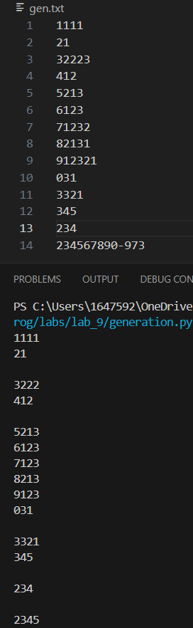

# Лабораторная работа №9
## Вариант 2
### Ход работы
1. Решите задачу своего варианта.
2. Оформите отчёт в README.md. Отчёт должен содержать:
3. Условия задач
4. Описание проделанной работы
5. Скриншоты результатов
6. Ссылки на используемые материалы
## Задание варианта
**Генератор для построчного чтения файла. Если длина строки превышает заданный предел - возвращает подстроку допустимого размера.**
## Код
```
def readfile(file, len):
    with open(file, 'r') as file:
        for line in file:
            yield line[:len]

file = 'gen.txt' 
len = 4 #максимальная длина строки

for line in readfile(file, len):
    print(line)
```
